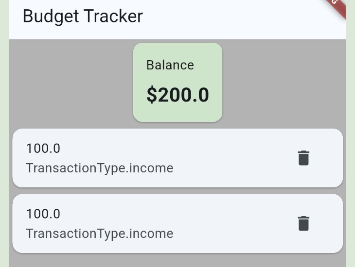

# Budget Tracker

Simple Flutter application for tracking income and expenses.  
Budget Tracker allows users to add and remove transactions and automatically calculates the current balance.

## Screenshots

## Features

* Add transaction
* Delete transaction
* Undo delete action
* Automatic balance calculation
* Empty state for new users
* Responsive layout (phone / tablet)
* Basic animations
