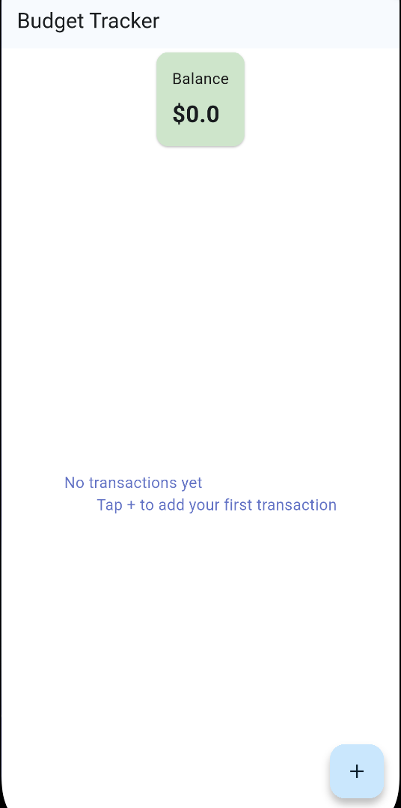
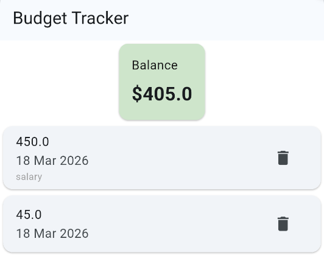
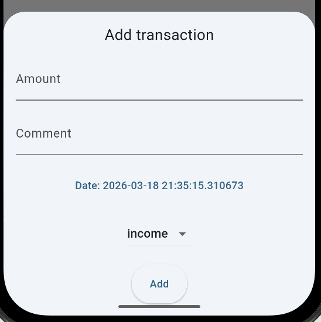
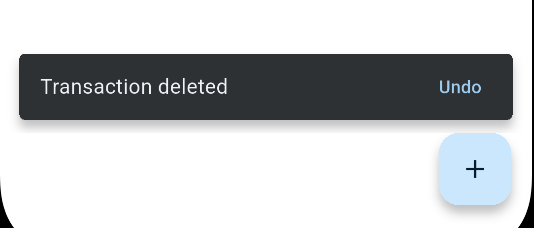

# Budget Tracker

Simple Flutter application for tracking income and expenses.  
Budget Tracker allows users to add and remove transactions and automatically calculates the current balance.

This project was made as part of my Flutter learning way to practice UI design, state management and responsive layouts.
## Screenshots







## Features

* Add transaction
* Delete transaction
* Undo delete action
* Automatic balance calculation
* Empty state for new users
* Responsive layout (phone / tablet)
* Basic animations
* Clean and readable transaction list

## Tech Stack

- Flutter
- Dart
- Riverpod
- Material 3
- intl

## Run project
```bash
git clone
flitter pub get
flutter run
